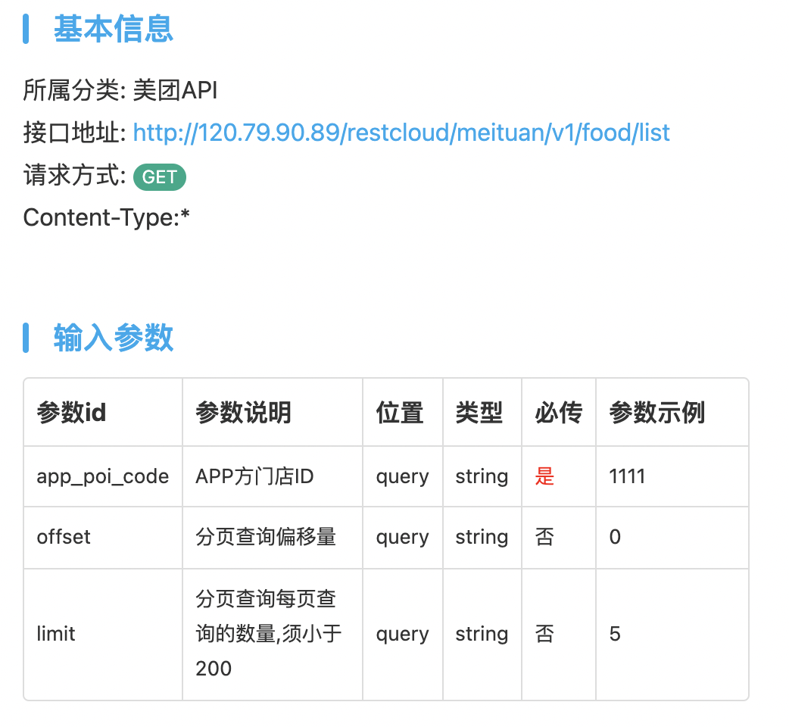
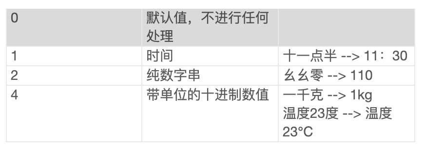
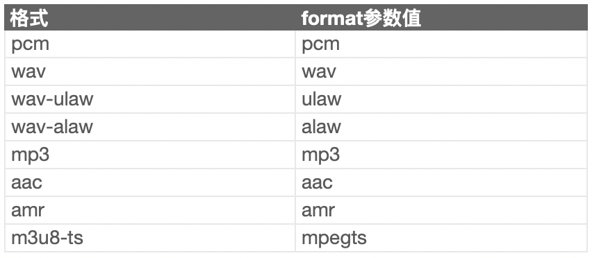
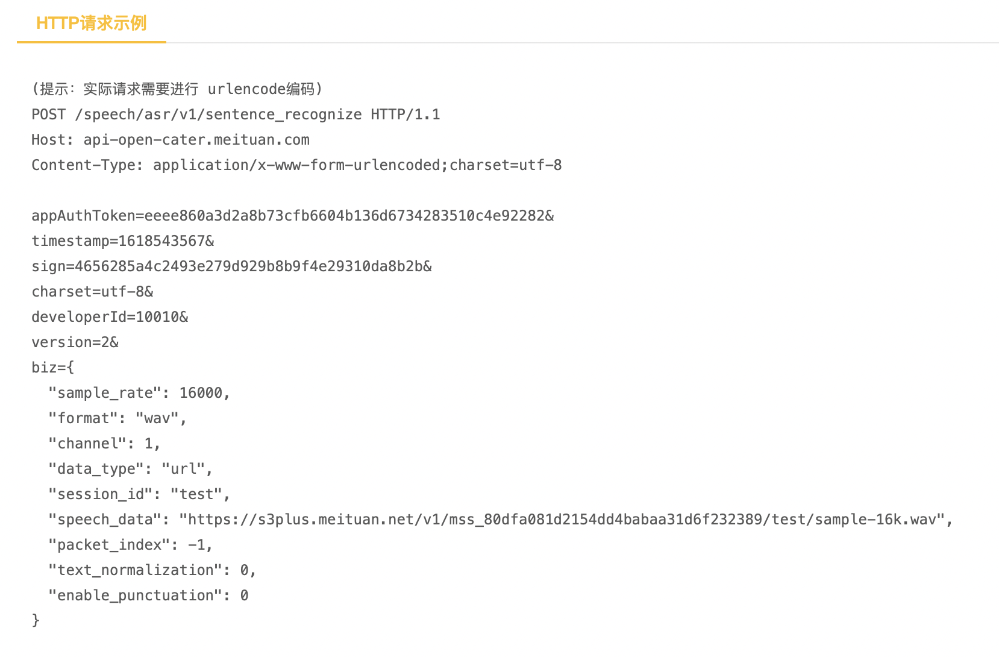
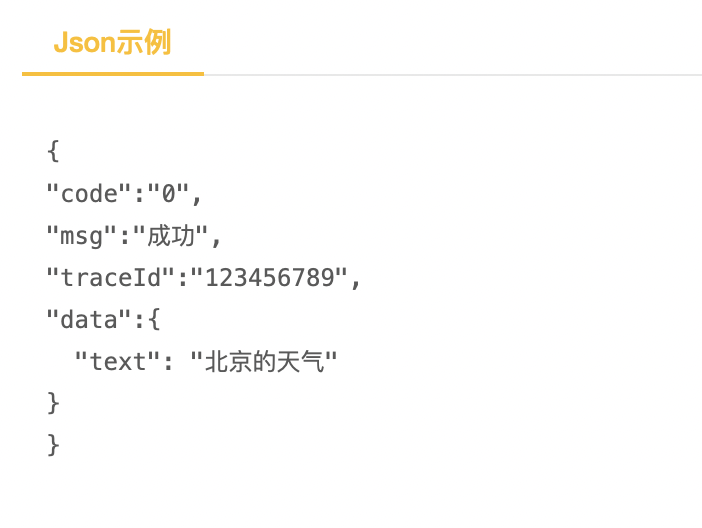
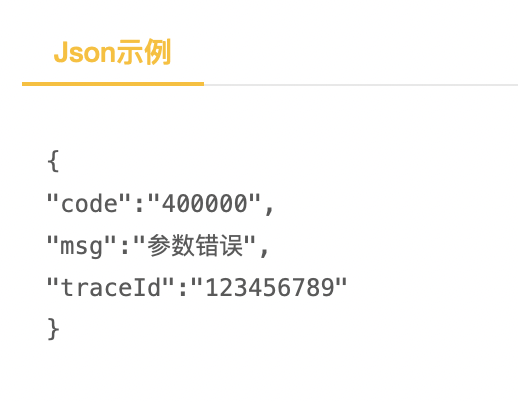

# 美团餐饮分析

## 0.小组成员
191250009 陈家志
191250084 林均劼
191250093 刘庭烽
191250016 陈梓俊
191250190 张潮越

## 1.概述

## 2.集成逻辑

​	以美团外卖为例，在美团餐饮系列APP中普遍存在表示集成、数据集成和功能集成

​	**表示集成：**
​	
​	美团外卖的界面上存在UI界面的集成：包括自己内部的一些餐饮分类，以及一些外部的如美团跑腿，美团买药，超市便利等图形选项，选中点击后就会跳转到对应的应用分区，因为美团餐饮的体系化，不同的应用门类都可以显示风格统一内嵌式集成页面。

​	**数据集成：**

​	美团餐饮结合地图数据，位置信息数据，餐厅均价数据等多个信息源综合数据进行分析和决策，为用户提供基于不同准则（距离、价格）推荐的餐饮列表。同时美团餐饮会动态根据其中一个信息源的信息来更新另一个信息源的数据，比如在计算均价的时候，会根据目前商家的红包力度与用户会员与否的信息，动态地推荐性价比最高的餐厅。评价区还同时集成大众点评应用对餐厅的评价

​	**功能集成：**

​	美团外卖中集成了许多其他应用程序的功能，例如：凯立德的地图信息，大众点评查看评价功能，微信/支付宝的支付功能等。美团外卖存在与这些平台的接口调用关系。

## 3.实现机制

### 3.1 概述 

​    **美团餐饮采取了Web Services技术：**

​	Web Services 是一组可被其他应用程序使用、使用开放协议进行通信、独立的（self-contained）并可自我描述的应用程序组件，可以被发布、定位、并通过Web调用。一方面，美团餐饮定义并实现服务请求者所需要的Web Services，例如在线点餐、优惠券设置等外部接口，让厂商可以通过配置对应的接口参数，实现自身餐饮服务在美团餐饮相关平台上的部署。另一方面美团餐饮系列的APP也可以作为请求者，相关客户端中继承了许多外部应用的接口，例如可以调用导航接口调用外部的导航地图应用来为消费者寻找通往目的餐厅的路线/查看对应餐厅的地理位置考虑是否自行取餐。

### 3.2 挑某个接口

### 3.3 美团查询门店菜品列表接口

1. 通过请求美团此API实现门店菜品的获取

2. 官方实例（包括参数说明）

3. 页面跳转展示（进入任一一个商家即可获取门店菜单列表）

## 3.2 语音交互技术API

#### 3.2.1 场景介绍

美团智能语音服务基于业界先进的算法技术及本地生活业务沉淀，提供灵活可靠的语音大数据处理和智能响应能力，助力企业开拓新场景、新服务、新价值，显著提升服务质量和效率。语音识别采用业界先进的深度学习技术，能将语音快速准确识别为文字，广泛应用于语音交互、机器人对话、语音内容分析等场景。

#### 3.2.2 优点

- 识别率高

  ​    识别率达到业界领先水平，基于美团本地生活业务沉淀，在生活服务场景识别效果更好，与美团App语音搜索、外卖App语音助理使用一套服务，效果绝佳。

- 接入灵活

  ​    提供API和Android、iOS版本的SDK，满足服务端和移动端的各种业务场景需求，开发接入成本极低。

- 服务可靠

  ​    企业级稳定服务保障，已成功应用于美团多个核心应用，技术稳定，服务可靠。

#### 3.3 API效果

如图，点击界面右上方的麦克风按钮进入语音识别界面

说出想要识别的内容（此处为“麦当劳”）

识别后跳转出app搜索内容

#### 3.4 API细节

##### 1.HTTPS请求地址：https://api-open-cater.meituan.com/speech/asr/v1/sentence_recognize

**2.公共请求参数**

| **参数**     | **类型** | 最大长度 | 是否必填 | 描述                         | 示例值 |
| ------------ | -------- | -------- | -------- | ---------------------------- | ------ |
| appAuthToken | String   |          | 否       | 门店令牌，接口需要授权时必填 | abc    |
| sign         | String   |          | 是       | 数字签名                     | dwe    |
| timestamp    | Long     |          | 是       | 时间戳，单位妙               | 123    |
| charset      | String   |          | 是       | 字符编码                     | Utf-8  |
| developerId  | Long     |          | 是       | 服务商身份标识               | 100    |
| version      | String   |          | 是       | 版本号，固定传2              | 2      |
| businessId   | int      |          | 是       | 业务类型id                   | 18     |

**3.业务请求参数**

| 参数               | 类型    | 最大长度 | 是否必填 | 描述                                                         | 示例值 |
| ------------------ | ------- | -------- | -------- | ------------------------------------------------------------ | ------ |
| session_id         | string  | 64       | 是       | 标识一次完整的识别请求，长度不超过64字节                     |        |
| format             | string  |          | 是       | 语音音频格式，目前支持的格式如下： | wav    |
| channel            | int     |          | 是       | 音频声道数；单声道1，双声道2                                 | 1      |
| sample_rate        | int     |          | 是       | 音频采样率；常见有8000，16000                                | 8000   |
| data_type          | string  |          | 是       | 音频数据类型；配合sppech_data使用。指定语音数据编码格式：url，base64 | Url    |
| speech_data        | string  |          | 是       | 配合data_type使用。语音数据                                  |        |
| packet_index       | int     |          | 否       | 仅在实时语音识别接口使用。数据包序号，从1开始，以-1*Seq结束。例如：1，2，4，-5 |        |
| enable_punctuation | boolean |          | 否       | 是否是用标点；默认不使用标点                                 |        |
| text_normalization | int     |          | 否       | 文本标准化，取值如下：           |        |

**4.公共响应参数**

| 参数    | 类型   | 描述                                                         | 示例值              |
| ------- | ------ | ------------------------------------------------------------ | ------------------- |
| code    | String | 响应状态码，code为OP_SUCCESS表示响应成功，其他状态码表示响应失败。具体系统错误码可以参考[系统错误码](https://developer.meituan.com/docs/biz/comm-errcode1)。 | OP_SUCCESS          |
| msg     | String | 错误消息                                                     | 成功/鉴权失败       |
| traceId | String | 请求消息唯一标识                                             | 7457794513993866186 |
| data    | Object | 业务数据，为Json对象，如果请求错误，该字段可能会展示错误的详细信息。 | {}                  |

**5.业务响应参数**

| 参数 | 类型   | 描述     | 示例值 |
| ---- | ------ | -------- | ------ |
| text | string | 识别文本 |        |

**6.请求示例**

**7.响应示例**

**8.异常示例**

**9.业务错误码**

| 错误码 | 错误描述       | 解决方案             |
| ------ | -------------- | -------------------- |
| 400000 | 参数错误       | 检查传入参数         |
| 400100 | 音频错误       | 检查语音地址是否有效 |
| 400101 | 音频格式错误   | 检查语音格式         |
| 500000 | 服务器内部错误 | 重试或找负责人排查   |

- 流程分析：
  - 用户在商家列表中选择任一一家商家点击进入
  - 手机端页面跳转至指定商家页面
  - 美团通过HTTP请求向后端请求具体菜品数据，并作展示

## 4.补充说明
