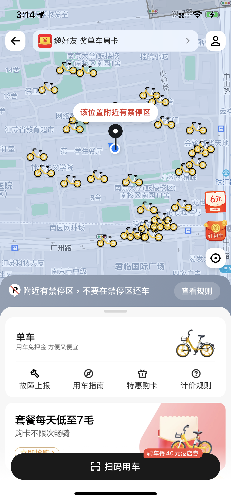
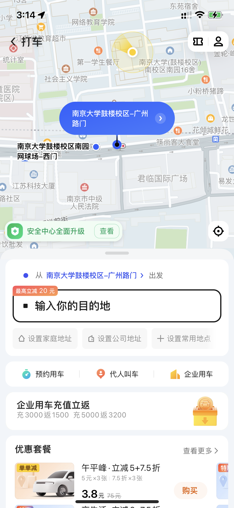

# 美团餐饮分析

# 0.参与成员
191250009 陈家志
191250084 林均劼
191250093 刘庭烽  
191250016 陈梓俊
191250190 张潮越
191250177 杨骏丰
191250171 颜昊明
191250128 孙钰昇
191250131 唐家伦

# 1.概述

日常生活中如果我们需要点外卖，或者需要查看某个餐厅的评价和菜品，又或者需要线上预约时，美团是我们一个常见的选择，美团在中国互联网公司中，市值排名第三，其业务包括外卖送餐、到店餐饮、购买电影票、购买火车票、购买机票、共享单车、网约车、酒店旅游、民宿公寓、电商等。我们知道，外卖行业主要由线上平台、店家、骑手和终端用户四部分组成，线上外卖平台扮演连接、沟通、协调、配合、促进，同时又在其中盈利的关键核心角色，对接线下的商家、骑手和用户三方，基于平台自身具备的算法和人工智能等技术，匹配骑手、餐饮商户、消费者并计算三者之间的最短距离，实时追踪配送信息与订单等。

美团一开始作为一个外卖线上平台，如今不断发展从外卖发展到餐饮，再到后续的送货上门、娱乐、交通等各式各样的服务。在送货上门服务上，入驻平台的不仅是传统外卖商家，更包括药店、超市便利店、零售批发商（如水果，蔬菜等），是一个多样化商家的平台；在娱乐方面，涵盖了日常生活中各式各样的娱乐方式，为我们提供信息查询，服务预约等功能，同时在其中集成了美团打车的交通服务，提供无缝出行体验；在交通娱乐方面，集成了酒店民宿预定，门票预定，美团打车，美团单车等各式功能。美团必然集成了第三方支付接口，如支付宝、微信支付等，作为上述服务的付费通路。

由此可以看出，美团如今不仅是一个外卖软件，其强大的商家与客户连接能力，路线规划能力，俨然成为了一个O2O（Online To Offline）平台，集合了各式各样的商家数据与服务，其背后底层逻辑必然需要对异构的数据做出相应的处理。我们的调研报告就将针对美团的集成技术与数据挖掘，从集成逻辑、实现机制来向大家介绍美团是如何实现如此多商家，服务的有机结合

# 2.集成逻辑

​	在美团餐饮系列APP中普遍存在表示集成、数据集成、功能集成和业务集成

## 2.1 **表示集成：**

|  |  |  |  |
| ------------------------------------------- | ------------------------------------------------------------ | ------------------------------------------------------------ | ------------------------------------------------------------ |

​	美团外卖的界面上存在UI界面的集成：如图片所示，美团客户端为外卖、美食、酒店/民宿、休闲/玩乐，电影/演出等诸多子系统提供了统一的用户界面，通过点击相应图像按钮可以跳转到相应的服务，供用户进行选择。美团的表示集成设计图像风格统一，易于用户理解使用，用户可以通过美团客户端快捷使用各个子系统，达到可见即可得。

## 2.2 **数据集成：**

​	美团餐饮结合地图数据，位置信息数据，餐厅均价数据，用户偏好数据和商家售卖数据等多个信息源综合数据进行分析和决策，为用户提供基于不同准则（距离、价格）推荐的餐饮列表。
​	美团餐饮会通过实时流计算挖掘数据中有价值信息实现AI推荐，从而对用户进行客制化推荐，以更高效的服务用户。美团也会以一个信息源的信息来更新另一个信息源，即动态根据其中一个信息源的信息来更新另一个信息源的数据，比如在计算均价的时候，会综合目前商家的红包力度与用户会员与否的信息，用户最近偏好食品的变化，动态地推荐合适餐厅。评价区还同时集成大众点评应用对餐厅的评价。

## 2.3 **功能集成：**

​	美团外卖中集成了许多其他应用程序的功能，例如：猫眼电影的电影购票、电影评分功能、凯立德的地图信息，大众点评查看评价功能，微信/支付宝的支付功能等。美团外卖存在与这些平台的接口调用关系，这些功能集成为用户提供了更多的功能与更好的体验，使得用户可以得到一站式服务体验，从而能吸引更多用户群体，获得更多潜在收益。

## 2.4 业务集成：

​	美团中在支付时可以通过调用美团的支付sdk，选择通过美团支付或者微信支付宝等第三方交易平台进行在线交易，由此可以看出美团通过使用xml通信层将电商企业服务和电子交易外部应用集成到核心构建业务功能集，帮助企业获得全面业务透视，从而有能力全面掌控业务。

# 3.实现机制

## 3.1 概述 

​    **美团餐饮采取了Web Services技术：**

​	Web Services 是一组可被其他应用程序使用、使用开放协议进行通信、独立的（self-contained）并可自我描述的应用程序组件，可以被发布、定位、并通过Web调用。一方面，美团餐饮定义并实现服务请求者所需要的Web Services，例如在线点餐、优惠券设置等外部接口，让厂商可以通过配置对应的接口参数，实现自身餐饮服务在美团餐饮相关平台上的部署。另一方面美团餐饮系列的APP也可以作为请求者，相关客户端中继承了许多外部应用的接口，例如可以调用导航接口调用外部的导航地图应用来为消费者寻找通往目的餐厅的路线/查看对应餐厅的地理位置考虑是否自行取餐。

## 3.2 语音交互技术API

#### 3.2.1 场景介绍

美团智能语音服务基于业界先进的算法技术及本地生活业务沉淀，提供灵活可靠的语音大数据处理和智能响应能力，助力企业开拓新场景、新服务、新价值，显著提升服务质量和效率。语音识别采用业界先进的深度学习技术，能将语音快速准确识别为文字，广泛应用于语音交互、机器人对话、语音内容分析等场景。

#### 3.2.2 优点

- 识别率高

  ​    识别率达到业界领先水平，基于美团本地生活业务沉淀，在生活服务场景识别效果更好，与美团App语音搜索、外卖App语音助理使用一套服务，效果绝佳。

- 接入灵活

  ​    提供API和Android、iOS版本的SDK，满足服务端和移动端的各种业务场景需求，开发接入成本极低。

- 服务可靠

  ​    企业级稳定服务保障，已成功应用于美团多个核心应用，技术稳定，服务可靠。

#### 3.2.3 API效果

如图，点击界面右上方的麦克风按钮进入语音识别界面

说出想要识别的内容（此处为“麦当劳”）

识别后跳转出app搜索内容

#### 3.2.4 API细节

**1.HTTPS请求地址：https://api-open-cater.meituan.com/speech/asr/v1/sentence_recognize**

**2.公共请求参数**

| **参数**     | **类型** | 最大长度 | 是否必填 | 描述                         | 示例值 |
| ------------ | -------- | -------- | -------- | ---------------------------- | ------ |
| appAuthToken | String   |          | 否       | 门店令牌，接口需要授权时必填 | abc    |
| sign         | String   |          | 是       | 数字签名                     | dwe    |
| timestamp    | Long     |          | 是       | 时间戳，单位妙               | 123    |
| charset      | String   |          | 是       | 字符编码                     | Utf-8  |
| developerId  | Long     |          | 是       | 服务商身份标识               | 100    |
| version      | String   |          | 是       | 版本号，固定传2              | 2      |
| businessId   | int      |          | 是       | 业务类型id                   | 18     |

**3.业务请求参数**

| 参数               | 类型    | 最大长度 | 是否必填 | 描述                                                         | 示例值 |
| ------------------ | ------- | -------- | -------- | ------------------------------------------------------------ | ------ |
| session_id         | string  | 64       | 是       | 标识一次完整的识别请求，长度不超过64字节                     |        |
| format             | string  |          | 是       | 语音音频格式，目前支持的格式如下： | wav    |
| channel            | int     |          | 是       | 音频声道数；单声道1，双声道2                                 | 1      |
| sample_rate        | int     |          | 是       | 音频采样率；常见有8000，16000                                | 8000   |
| data_type          | string  |          | 是       | 音频数据类型；配合sppech_data使用。指定语音数据编码格式：url，base64 | Url    |
| speech_data        | string  |          | 是       | 配合data_type使用。语音数据                                  |        |
| packet_index       | int     |          | 否       | 仅在实时语音识别接口使用。数据包序号，从1开始，以-1*Seq结束。例如：1，2，4，-5 |        |
| enable_punctuation | boolean |          | 否       | 是否是用标点；默认不使用标点                                 |        |
| text_normalization | int     |          | 否       | 文本标准化，取值如下：           |        |

**4.公共响应参数**

| 参数    | 类型   | 描述                                                         | 示例值              |
| ------- | ------ | ------------------------------------------------------------ | ------------------- |
| code    | String | 响应状态码，code为OP_SUCCESS表示响应成功，其他状态码表示响应失败。具体系统错误码可以参考[系统错误码](https://developer.meituan.com/docs/biz/comm-errcode1)。 | OP_SUCCESS          |
| msg     | String | 错误消息                                                     | 成功/鉴权失败       |
| traceId | String | 请求消息唯一标识                                             | 7457794513993866186 |
| data    | Object | 业务数据，为Json对象，如果请求错误，该字段可能会展示错误的详细信息。 | {}                  |

**5.业务响应参数**

| 参数 | 类型   | 描述     | 示例值 |
| ---- | ------ | -------- | ------ |
| text | string | 识别文本 |        |

**6.请求示例**

**7.响应示例**

**8.异常示例**

**9.业务错误码**

| 错误码 | 错误描述       | 解决方案             |
| ------ | -------------- | -------------------- |
| 400000 | 参数错误       | 检查传入参数         |
| 400100 | 音频错误       | 检查语音地址是否有效 |
| 400101 | 音频格式错误   | 检查语音格式         |
| 500000 | 服务器内部错误 | 重试或找负责人排查   |

- 流程分析：
  - 用户在商家列表中选择任一一家商家点击进入
  - 手机端页面跳转至指定商家页面
  - 美团通过HTTP请求向后端请求具体菜品数据，并作展示

## 3.3 美团查询门店菜品列表接口

1. 通过请求美团此API实现门店菜品的获取

2. 官方实例（包括参数说明）

3. 页面跳转展示（进入任一一个商家即可获取门店菜单列表）

# 4.数据挖掘

数据挖掘是通过分析每个数据，从大量数据中寻找其规律的技术，主要有数据准备、规律寻找和规律表示三个步骤。数据准备是从相关的数据源中选取所需的数据并整合成用于数据挖掘的数据集；规律寻找是用某种方法将数据集所含的规律找出来；规律表示是尽可能以用户可理解的方式（如可视化）将找出的规律表示出来。数据挖掘的任务有关联分析、聚类分析、分类分析、异常分析、特异群组分析和演变分析等。美团通过数据挖掘，将数据挖掘应用到商家排序、外卖路线选择等算法中，为用户提供更好的服务。

美团的主要业务是点评功能，务求快速高效地把热门高评分的商铺推荐给大家。美团要分析每一家店铺的用户评分和评论，分析点击数和购买票卷的数量来分析它的热度。美团的用户群体学生、白领、社区以及商旅，甚至包括在KTV等娱乐场所消费的人群。随着供给和消费人群的多样化，如何在供给和用户之间做一个对接是美团的主要任务。

# 5.补充说明

美团的战略定位聚焦于Food+Platform，以吃为核心建设生活服务业从需求侧到供给侧的多层次科技服务平台，创造一个集吃喝玩乐全都有的生活生态系统，因此美团集成了一系列异构的美团自身子服务系统。在支付上，美团集成了第三方支付接口，如支付宝、微信支付等，但是美团仍在发展自己的美团支付，希望能够成为一个包罗万象服务的集成系统。
