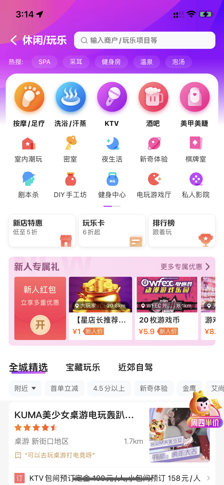

## 美团分析

[TOC]

### 组员

杨骏丰 191250177 

颜昊明 191250171

孙钰昇 191250128

唐家伦 191250131

### 1. 概述

美团在中国互联网公司中，市值排名第三，其业务包括外卖送餐、到店餐饮、购买电影票、购买火车票、购买机票、共享单车、网约车、酒店旅游、民宿公寓、电商等。在美团 APP 里集成了吃、住、行，想必我们每个人的手机里都会安装美团 APP，在 APP 里能满足我们外出的大多数需求，当我们点开外卖页面，我们就能够看到所有提供外送服务的餐厅，显示出我们与餐厅的距离，餐厅的营业时间，以及餐厅的菜品。对于到店餐饮、娱乐场所、酒店等，美团会向你展示它的详细介绍，你甚至可以直接在 app 内看到店铺的价格与评价，也可以直接购买各种优惠券。在购买各种票券方面，美团涵盖了电影票、飞机票、高铁票、演出门票、景点门票等，我们能够查看各种票卷的详细信息，包括时间和地点。在打车方面，你可以选择美团直营的美团快车，或者选择曹操出行、神舟出行、首汽出行等出行服务。而在共享单车方面，美团单车更是共享单车的行业龙头，拥有最多的单车数量，用户可以随时随地地租借单车。美团更在最近提供了电商、买菜等功能，进一步扩大它的服务体系。

在与其他软件进行联合方面，为了实现信息共享，美团提供了美食，酒店，猫眼电影，旅游门票的外部服务接口，让其他厂商可以在 APP 中跳转到美团的信息页面和支付页面。而且也为餐厅、酒店等提供 API 接口，让他们可以把美图提供的预定、付款等功能直接内陷到他们的公众号、小程序、APP、网页中。

我们可以看出，美团不只是一个团购 APP，它让消费者和商家紧密地连接在一起，让美团成为了一个 O2O 平台总入口。它的底层有着复杂的大数据后台支撑，融合了多种第三方数据，提供多种第三方接口。我们会就美团的集成逻辑、实现机制、数据挖掘等方向来总结美团是如何把这些数据集成到一个 APP 中。

### 2. 集成逻辑

在美团中存在表示集成、数据集成、功能集成和业务集成。

#### 2.1表示集成

如图片所示，美团客户端为外卖、美食、酒店/民宿、休闲/玩乐，电影/演出等诸多子系统提供了统一的用户界面，通过点击相应图像按钮可以跳转到相应的服务，供用户进行选择。美团的表示集成设计图像风格统一，易于用户理解使用，用户可以通过美团客户端快捷使用各个子系统，达到可见即可得。

#### 2.2 数据集成

如图片所示，美团结合地图数据、位置信息数据、用户偏好数据和商家售卖数据等多个信息源综合数据进行分析和判断，通过实时流计算挖掘数据中有价值信息实现AI推荐，从而对用户进行客制化推荐，以更高效的服务用户。美团也会以一个信息源的信息来更新另一个信息源，如根据用户位置信息的变化、用户最近偏好食品的变化来及时更新调整对用户推荐商品列表的数据。

#### 2.3 功能集成

美团中也集成了许多其他应用程序的功能，如猫眼电影的电影购票、电影评分功能等，美团存在与这些平台的接口调用关系。这些功能集成为用户提供了更多的功能与更好的体验，使得用户可以得到一站式服务体验，从而能吸引更多用户群体，获得更多潜在收益。

#### 2.4 业务集成

美团中在支付时可以通过调用美团的支付sdk，选择通过美团支付或者微信支付宝等第三方交易平台进行在线交易，由此可以看出美团通过使用xml通信层将电商企业服务和电子交易外部应用集成到核心构建业务功能集，帮助企业获得全面业务透视，从而有能力全面掌控业务。

### 3. 实现机制

#### Web数据集成

Web Service是一个平台独立的，低耦合的，自包含的、基于可编程的web的应用程序，可使用开放的XML（标准通用标记语言下的一个子集）标准来描述、发布、发现、协调和配置这些应用程序，用于开发分布式的交互操作的应用程序。Web Service技术， 能使得运行在不同机器上的不同应用无须借助附加的、专门的第三方软件或硬件， 就可相互交换数据或集成。依据Web Service规范实施的应用之间， 无论它们所使用的语言、 平台或内部协议是什么， 都可以相互交换数据。Web Service是自描述、 自包含的可用网络模块， 可以执行具体的业务功能。Web Service也很容易部署， 因为它们基于一些常规的产业标准以及已有的一些技术，诸如标准通用标记语言下的子集XML、HTTP。Web Service减少了应用接口的花费。

#### 表示集成

通过将封装式应用的表示与遗留应用的表示结合起来，形成统一的用户界面来实现表示集成

#### 数据集成

使用数据时，将多个信息源，如打车、火车票、酒店、外卖等功能渠道获取到的数据，通过数据和转换、数据库访问中间件和开放式数据连接ODBC，集成为一个数据集使用。也就是说，任何一个功能都能访问到所有功能收集到的数据。

### 4. 数据挖掘

数据挖掘是通过分析每个数据，从大量数据中寻找其规律的技术，主要有数据准备、规律寻找和规律表示三个步骤。数据准备是从相关的数据源中选取所需的数据并整合成用于数据挖掘的数据集；规律寻找是用某种方法将数据集所含的规律找出来；规律表示是尽可能以用户可理解的方式（如可视化）将找出的规律表示出来。数据挖掘的任务有关联分析、聚类分析、分类分析、异常分析、特异群组分析和演变分析等。美团通过数据挖掘，将数据挖掘应用到商家排序、外卖路线选择等算法中，为用户提供更好的服务。

美团的主要业务是点评功能，务求快速高效地把热门高评分的商铺推荐给大家。美团要分析每一家店铺的用户评分和评论，分析点击数和购买票卷的数量来分析它的热度。美团的用户群体学生、白领、社区以及商旅，甚至包括在KTV等娱乐场所消费的人群。随着供给和消费人群的多样化，如何在供给和用户之间做一个对接是美团的主要任务。